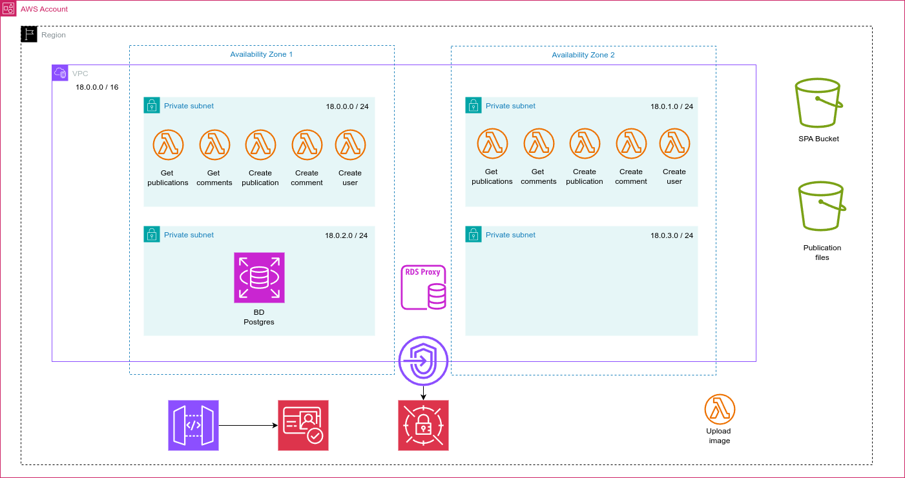

# Soul Pupils TP 3 
### Cloud Computing - Grupo 2 - 2024 ITBA

## Tabla de contenidos
- [Introducción](#introducción)
- [Arquitectura](#arquitectura)
- [Pre-requisitos](#pre-requisitos)
- [Ejecución](#ejecución)
- [Módulos](#módulos)
- [Algunas funciones utilizadas](#algunas-funciones-utilizadas)
- [Meta-argumentos utilizados](#meta-argumentos-utilizados)
- [Participación](#participación)

## Introducción
Soul pupils es un sitio web que busca lograr que los estudiantes puedan compartir sus experiencias y conocimientos con otros estudiantes.

Fue desarrollado en el marco de la materia Cloud Computing de la carrera de Ingeniería en Informática en el ITBA.

El frontend es una SPA alojada en S3 desarrollada usando SvelteKit.

El backend se basa en una serie de Lambdas de AWS escritas en Python, y se utiliza una base de datos RDS PostgreSQL, accesible a través de un RDS Proxy, para almacenar las publicaciones.

Las imagenes de las publicaciones se guardan en un bucket de S3, y pueden ser cargadas utilizando una Lambda Regional.

Toda la autenticación se realiza utilizando Cognito.

## Arquitectura


## Requisitos
- Terraform v1.8.5 o superior
- AWS CLI
- Docker
- npm v9.6.7 o superior

Las pruebas se realizaron en máquinas con Linux (Ubuntu) y MacOS.

## Ejecución
1. Clonar el repositorio
2. Ingresar al directorio `frontend` y ejecutar `npm install`
3. Ingresar al directorio `terraform` y ejecutar `terraform init`
4. Ejecutar `terraform apply -auto-approve` (habiendo configurado previamente el perfil del lab de AWS)

El proyecto puede tardar 20 minutos en completarse.
Si llegara a fallar por algún motivo se recomienda volver a correr el paso 4.

5. Luego de esperar un tiempo prudencial (5~10min), ejecutar el comando `aws lambda invoke --function-name init_db response.json --region us-east-1` para inicializar la base de datos. Se decidió no inicializar la base de datos dentro de terraform ya que esto no es infraestructura y trasciende el uso de terraform.
6. Utilizar la URL del frontend provista por el bucket con nombre prefijo `soul-pupils-spa`.


## Módulos
### Internos
- `dockerized_lambdas`: crea las lambdas que utilizan docker. Para esto, requiere sus nombres, subnets en las que se encuentran, variables de entorno, vpc, rol y id de la cuenta de Amazon. Como output, devuelve el security group asociado a las lambdas y el objeto asociado a cada una de ellas.
- `s3`: crea un bucket. Para esto, requiere su nombre, un flag para saber si el bucket se utilizará para hostear los archivos de la SPA, y si tiene versionado. Como output, devuelve el nombre del bucket, su id y el endpint para acceder al sitio web en caso de alojar sus archivos. 
Observación: debido a que CloudFront no está habilitado en el LAB, no se pudieron tomar medidas para mejorar la seguridad y el cacheo de los archivos de los buckets, y toda su información es pública. Esto fue debidamente discutido, y es una decisión de diseño frente a las limtaciones del LAB.
- `zipped_lambda`: crea una lambda utilizando un archivo .zip. Para esto, requiere su nombre, variables de entorno, rol y el hash del código fuente. Como output devuelve el nombre, la url y el arn de la función.
### Externos
- `vpc`: crea una VPC. https://registry.terraform.io/modules/terraform-aws-modules/vpc/aws/latest
- `aws_db_proxy`: crea una base de datos RDS. https://registry.terraform.io/providers/hashicorp/aws/latest/docs/resources/db_proxy
Observación: debido a que cada `terraform apply` provoca que se modifique el proxy (cosa que tarda mucho), se decidió copiar a mano el módulo en el proyecto y modificarlo.


## Algunas funciones utilizadas
- `slice`: Corta una lista en un rango dado. Es utilizada para particionar los cidrs dentro del cidr de la vpc:
```tf
  private_subnet_cidrs  = slice(local.cidrs, 0, 2)
```
- `merge`: Combina dos mapas. Es utilizada para combinar las lambdas dockerizadas con las comunes y poder registrarlas en el API Gateway:
```tf
  all_lambdas = merge(local.private_lambdas, local.regional_lambdas)
```
- `timestamp`: Devuelve la fecha y hora actual. Es utilizada para garantizar que los scripts de inicialización se ejecuten siempre:
```tf
    always_run = "${timestamp()}" 
```
- `cidrsubnets`: Permite dividir una subred en subredes más pequeñas. Es utilizada para generar los cidrs de las subnets privadas:
```tf
  private_subnets = cidrsubnets(var.vpc_cidr_block, 8, 8, 8, 8)
```
- `toset`: Convierte una lista en un conjunto.
```tf
  for_each   = toset(var.lambda_names)
```


## Meta-argumentos utilizados
- `depends_on`: le indica a Terraform que complete todas las acciones en el objeto de dependencia antes de realizar acciones en el objeto que declara la dependencia.
Un caso de uso en el proyecto, es en el modulo `dockerized_lambdas`, en el que se requiere que las imagenes ya se encuentren subidas antes de crear los lambdas.
```tf
  depends_on = [terraform_data.deploy_images]
```

- `for_each`: sirve para crear múltiples instancias de un recurso definido. También brinda la flexibilidad de configurar dinámicamente los atributos de cada instancia de recurso creada, dependiendo del tipo de variables que se utilicen.
Un caso de uso en el proyecto es el de creación de las lambdas.
```tf
  for_each   = toset(var.lambda_names)
```

- `count`: similar a `for_each`, únicamente identifica a los recursos por índice. Si bien también se utiliza para crear múltiples instancias de un recurso definido, no permite configurar dinámicamente los atributos de cada instancia de recurso creada. El mejor uso que tiene es, dentro de los módulos, para crear recursos "condicionalmente" según las variables que se pasen.
```tf
resource "aws_s3_bucket_website_configuration" "this" {
  count = var.s3_is_website ? 1 : 0
  ...
}
```

- `lifecycle`: los argumentos de lifecycle ayudan a controlar el flujo de las operaciones de Terraform al crear teglas personalizadas para la creación y destrucción de recursos. En este caso, se utiliza para el API Gateway, para que en caso de realizar ajustes que impliquen eliminarlo, se cree primero otro para no perjudicar la disponibilidad.
```tf
lifecycle {
  create_before_destroy = true
}
```

## Participación
| Nombre | Participación |
| ------ | ------------- |
| Liu, Jonathan | 33% |
| Vilamowski, Abril | 33% |
| Wischñevsky, David | 33% |

